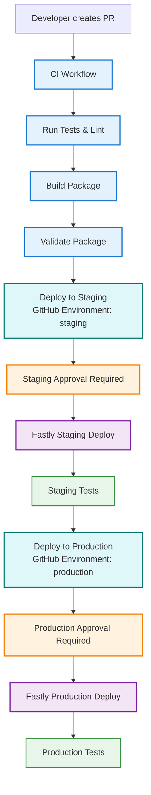

# Geonet Open Data S3 Browser

A Fastly Compute\@Edge application written in Go that lets users browse and download files from the public **Geonet Open Data** S3 bucket via a web interface. All requests are proxied through your Fastly service, so users see your domain—not the S3 bucket URL.

## Features

* Browse folders and files from a public S3 bucket
* Clean breadcrumb-style navigation
* File downloads and previews are proxied through Fastly
* No AWS credentials required
* Separate staging and production environments supported
* Automated deployment with GitHub Actions

## Local Development

1. **Install prerequisites:**

   * [Go](https://golang.org/dl/) (v1.23+ recommended)
   * [Fastly CLI](https://developer.fastly.com/reference/cli/)

2. **Build and run locally:**

   ```sh
   fastly compute build && fastly compute serve
   ```

   Then open [http://127.0.0.1:7676](http://127.0.0.1:7676) in your browser.

## Deployment

### Initial Setup

1. **Log in to the Fastly CLI:**

   ```sh
   fastly profile create
   ```

2. **Initialize the project (if not already):**

   ```sh
   fastly compute init
   ```

3. **Create separate configs for environments:**

   ```sh
   cp fastly.toml fastly.staging.toml
   ```

   Update each with the correct `service_id`.

   * `fastly.toml` → used for **production** (default)
   * `fastly.staging.toml` → used for **staging**

---

### Build

1. **Build for Staging:**

   ```sh
   fastly compute build --env=staging
   ```

2. **Build for Production:**

   ```sh
   fastly compute build
   ```

   > Each environment uses its own `fastly.<env>.toml` configuration file

---

### Deploy

1. **Deploy to Staging:**

   ```sh
   fastly compute deploy --env=staging
   ```

   > This uses the `fastly.staging.toml` configuration and targets the staging domain.

2. **Deploy to Production:**

   ```sh
   fastly compute deploy
   ```

---

### Backend Configuration

To ensure the correct backend is set up and to remove the default `127.0.0.1` backend, use the following scripts:

#### Staging Backend

```sh
SERVICE_ID=$(grep '^service_id' fastly.staging.toml | cut -d '"' -f2)

# Get active version
ACTIVE_VERSION=$(fastly service-version list --service-id "$SERVICE_ID" | grep 'active: true' -B 4 | grep 'Number' | head -n1 | cut -d ':' -f2 | tr -d ' ')

# Clone it
CLONE_OUTPUT=$(fastly service-version clone --service-id "$SERVICE_ID" --version "$ACTIVE_VERSION")
NEW_VERSION=$(echo "$CLONE_OUTPUT" | grep 'to version' | grep -oE '[0-9]+$')

# Delete default backend if exists
DEFAULT_BACKEND_NAME=$(fastly backend list --service-id "$SERVICE_ID" --version "$NEW_VERSION" | awk '$3 == "originless" { print $3 }')
if [ -n "$DEFAULT_BACKEND_NAME" ]; then
  fastly backend delete \
    --name "$DEFAULT_BACKEND_NAME" \
    --service-id "$SERVICE_ID" \
    --version "$NEW_VERSION"
fi

# Add real backend
fastly backend create \
  --name TheOrigin \
  --address geonet-open-data.s3-ap-southeast-2.amazonaws.com \
  --port 443 \
  --use-ssl \
  --service-id "$SERVICE_ID" \
  --version "$NEW_VERSION"

# Activate it
fastly service-version activate --service-id "$SERVICE_ID" --version "$NEW_VERSION"
```

#### Production Backend

```sh
SERVICE_ID=$(grep '^service_id' fastly.toml | cut -d '"' -f2)

# Get active version
ACTIVE_VERSION=$(fastly service-version list --service-id "$SERVICE_ID" | grep 'active: true' -B 4 | grep 'Number' | head -n1 | cut -d ':' -f2 | tr -d ' ')

# Clone it
CLONE_OUTPUT=$(fastly service-version clone --service-id "$SERVICE_ID" --version "$ACTIVE_VERSION")
NEW_VERSION=$(echo "$CLONE_OUTPUT" | grep 'to version' | grep -oE '[0-9]+$')

# Delete default backend if exists
DEFAULT_BACKEND_NAME=$(fastly backend list --service-id "$SERVICE_ID" --version "$NEW_VERSION" | awk '$3 == "originless" { print $3 }')
if [ -n "$DEFAULT_BACKEND_NAME" ]; then
  fastly backend delete \
    --name "$DEFAULT_BACKEND_NAME" \
    --service-id "$SERVICE_ID" \
    --version "$NEW_VERSION"
fi

# Add real backend
fastly backend create \
  --name TheOrigin \
  --address geonet-open-data.s3-ap-southeast-2.amazonaws.com \
  --port 443 \
  --use-ssl \
  --service-id "$SERVICE_ID" \
  --version "$NEW_VERSION"

# Activate it
fastly service-version activate --service-id "$SERVICE_ID" --version "$NEW_VERSION"
```

---

### GitHub Actions Setup

1. **Configure GitHub Secrets:**

   Create one Fastly API token for **each environment** with the following minimum settings:

   #### Production Token

   * **Type**: Automation token
   * **Role**: Engineer
   * **Scope**:
     * ✅ `Global API access (global)` — required for deployment
   * **Access**: Only the `go-s3browser` service

   Set the following GitHub secrets:

   * `FASTLY_API_TOKEN`
   * `FASTLY_SERVICE_ID`

   #### Staging Token

   * **Type**: Automation token
   * **Role**: Engineer
   * **Scope**:
     * ✅ `Global API access (global)` — required for deployment
   * **Access**: Only the `go-s3browser-staging` service

   Set the following GitHub secrets:

   * `FASTLY_API_STAGING_TOKEN`
   * `FASTLY_SERVICE_STAGING_ID`

2. **GitHub Workflows:**

   Create two workflows that reference the appropriate secrets:

   * `.github/workflows/deploy-staging.yml`
   * `.github/workflows/deploy-production.yml`

---

## Project Structure

```plaintext
.
├── main.go                 # Main application code
├── fastly.toml            # Production configuration
├── fastly.staging.toml    # Staging configuration
├── .github/
│   └── workflows/
│       ├── deploy-staging.yml
│       └── deploy-production.yml
└── README.md
```

## Environment-Specific Notes

* **Production:** Served on your primary Fastly domain or custom domain.
* **Staging:** Configured using a separate `fastly.staging.toml` and deployed to an entirely different Fastly service.

> ⚠️ The built-in `--staging` flag in Fastly was not used due to key limitations:
>
> * It shares the same service ID and version history as production, making isolated testing difficult.
> * It does not support separate tokens or backend configurations per environment.
> * Accessing the staging domain requires manual DNS configuration on each developer's machine (e.g. modifying `/etc/hosts`) to map the staging hostname to a specific staging Fastly POP. See [Fastly's staging documentation](https://docs.fastly.com/en/guides/working-with-staging#accessing-the-staging-environment) for details.

*Both environments use the same source code and deployment logic.*

## Detailed Deployment Workflow

This section outlines the continuous deployment process triggered by Pull Requests, including the CI pipeline, staging and production deployments, and required approval steps.



### Workflow Details

1. **Pull Request Creation**
    * Developer creates a PR with changes
    * PR triggers CI workflow automatically

2. **CI Pipeline**
    * Run tests and linting
    * Build Fastly Compute package
    * Validate package
    * All checks must pass to proceed

3. **Staging Deployment**
    * Deploy to staging environment
    * Requires approval from authorized team member
    * Deploy to Fastly staging service
    * Run staging environment tests

4. **Production Deployment**
    * Deploy to production environment
    * Requires approval from authorized team member
    * Deploy to Fastly production service
    * Run production environment tests

### Environment Configuration

* **Staging**
  * Service ID: `CDK0EPs7gtbLrPnWa5QL92`
  * Environment: `staging`
  * Used for testing and validation

* **Production**
  * Service ID: `phyFDbHNtX6Ka4FMEnODt6`
  * Environment: `production`
  * Live environment for end users

### Approval Process

1. **Staging Approval**
    * Required before deploying to staging
    * Can be approved by team members with write access
    * Ensures changes are ready for testing

2. **Production Approval**
    * Required before deploying to production
    * Can be approved by team leads or senior members
    * Final verification before live deployment

### Testing Strategy

*Note: Staging and Production tests are currently performed manually.*

1. **Staging Tests**
    * Verify functionality in staging environment
    * Test with real S3 bucket data
    * Validate performance and behavior

2. **Production Tests**
    * Final verification in production environment
    * Smoke tests to ensure deployment success
    * Monitor for any immediate issues

test
