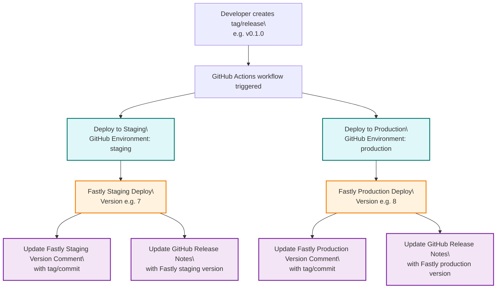

# test

```mermaid
flowchart TD
    A[Developer creates tag/release\\ne.g. v0.1.0] --> B[GitHub Actions workflow triggered]
    B --> C1[Deploy to Staging\\nGitHub Environment: staging]
    C1 --> D1[Fastly Staging Deploy\\nVersion e.g. 7]
    D1 --> E1[Update Fastly Staging Version Comment\\nwith tag/commit]
    D1 --> F1[Update GitHub Release Notes\\nwith Fastly staging version]
    B --> C2[Deploy to Production\\nGitHub Environment: production]
    C2 --> D2[Fastly Production Deploy\\nVersion e.g. 8]
    D2 --> E2[Update Fastly Production Version Comment\\nwith tag/commit]
    D2 --> F2[Update GitHub Release Notes\\nwith Fastly production version]

    %% Styling
    classDef env fill:#e0f7fa,stroke:#00796b,stroke-width:2px;
    class C1,C2 env;
    classDef fastly fill:#fff3e0,stroke:#f57c00,stroke-width:2px;
    class D1,D2 fastly;
    classDef update fill:#f3e5f5,stroke:#7b1fa2,stroke-width:2px;
    class E1,E2,F1,F2 update;
```
